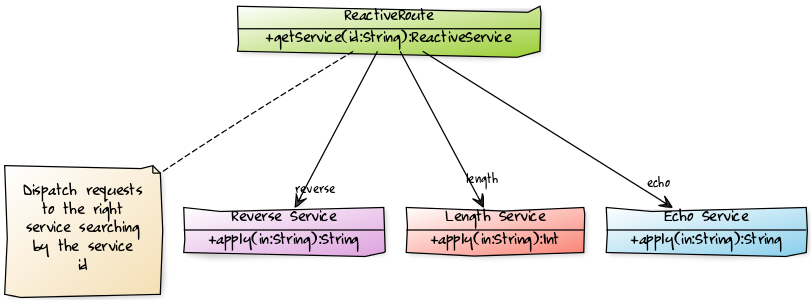

# Introduction

The Reactive System modules implement a full server and client service stack based on asynchronous message exchange implemented on top of the Kafka Broker.

Reactive System has been designed with the clear focus on providing tools for building integration layers for systems B2B based on asynchronous message exchange pattern.

## Asynchronous Message Exchange

Using message exchange rather than synchronous communication helps to build more decoupled systems, which gives us several advatages like:

1. Isolation: if a reactive system fails it doesn't affect its client.
2. Location transparency: reactive systems they don't communicate directly but through messages sent to 
   an address (topic), that way is not necessary to know the location of the reactive system exposing the
   service as long we can send a message to the topic address.
3. Elasticity: reactive services can implement scaling strategy on the way they consume the messages from a
   topic allowing to add (scale out) and remove (scale down) more reactive systems depending on the current
   demand.
4. DOS Immune: while a system which exposes APIs through a synchronous protocol is vulnerable to DOS attacks, 
   with Reactive System each service will consume the requests at each own speed.
   
## Using Reactive System

In order to use the Reactive System libraries you need to declare the following dependency on your sbt:

@@@vars
```sbt
"org.patricknoir.kafka" %% "kafka-reactive-service" % "$project.version$"
```
@@@

## Routing DSL for Reactive System servers

A Reactive System Route is in essence a map of services exposed by the server indexed against a service id.


Here is an example how you can create a route:

@@snip [SimpleRSServer.scala](../../../../examples/server/src/main/scala/org/patricknoir/kafka/examples/server/SimpleRSServer.scala) { #route-dsl-example }

The above code snipped generate a route that declare 3 services:

